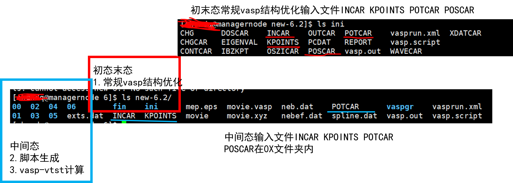

# 使用NEB方法计算反应路径

## 参考资料

- [vasp+VTST进行NEB过渡态计算 | cndaqiang](https://cndaqiang.github.io/2018/12/07/NEB/)
- [vasp-vtst计算过渡态--NEB方法 | 刘锦程](http://blog.wangruixing.cn/2019/08/19/cineb/)

这俩写的挺清楚的，建议直接进去看咯，下为~~摘抄~~笔记。

---

## 流程

1. 分别对初态和末态进行结构优化
2. 使用脚本生成中间过程图像(结构)
3. NEB计算
4. 处理结果

文件结构：

```
假设文件目录如下
neb
--ini                  # 作为初态结构优化的目录
	ini.xsd
--fin                  # 作为末态结构优化的目录
	ini.xsd
```



这张图整挺好，直接拿过来了，[这是原地址](cndaqiang.github.io/2018/12/07/NEB/) 。

## 分别对初态和末态进行常规的结构优化

上课时的例子是`O在N掺杂的石墨烯上的吸附`，其中`INCAR`为

```
Global Parameters
ISTART =  0            (Read existing wavefunction; if there)
LREAL  = .FALSE.          (Projection operators: automatic)
ENCUT  =  400        (Cut-off energy for plane wave basis set, in eV)
PREC   =  Normal       (Precision level)
LWAVE  = .FALSE.        (Write WAVECAR or not)
LCHARG = .FALSE.        (Write CHGCAR or not)
ALGO = Fast

Electronic Relaxation
ISMEAR =  0            (Gaussian smearing; metals:1)
SIGMA  =  0.1         (Smearing value in eV; metals:0.2)
NELM   =  60           (Max electronic SCF steps)
NELMIN =  4            (Min electronic SCF steps)
EDIFF  =  1E-04        (SCF energy convergence; in eV)

Ionic Relaxation
NSW    =  100          (Max electronic SCF steps)
IBRION =  2            (Algorithm: 0-MD; 1-Quasi-New; 2-CG)
ISIF   =  0          (Stress/relaxation: 2-Ions, 3-Shape/Ions/V, 4-Shape/Ions)
EDIFFG = -1E-01        (Ionic convergence; eV/AA)
POTIM = 0.3
```

需要注意的是两个`POSCAR`中，**元素顺序必须对应**，要不然后面测相似度会出问题，会变得很大。（通过cif2pos和xsd2pos的默认排的顺序不一样哦，已踩坑）

## 使用脚本处理中间过程

结构优化后，分别将初末态的`CONTCAR`复制出来作为新的初态和末态

```
$ cp ini/CONTCAR POSCAR_ini
$ cp fin/CONTCAR POSCAR_fin
```

### 对初末态测相似度以确定插点数量

```
$ dist.pl POSCAR_ini POSCAR_fin
```

> 若返回值<5，通常可以下一步
>
> 插点数量通常是`相似度/0.8`.

### 插入中间图像

```
$ nebmake.pl POSCAR_ini POSCAR_fin 3   # 3为插点数量，咱这儿把它记为N
filetype1: vasp5
filetype2: vasp5

OK, ALL SETUP HERE
FOR LATER ANALYSIS, PUT OUTCARs IN FOLDERS 00 and 04 !!!
```

> 提交任务时，CPU需要是插点数量N的整数倍

### 使用nebmovie查看生成的路线是否合理

```
$ nebmovie.pl
```

执行后会生成`movie.xyz`文件，`sz movie.xyz`下载，本地终端中使用`ase gui 文件路径`查看。

### 分别将初末态的`OUTCAR`复制到`00`和`N+1`文件夹

如果合理，根据`nebmake`的提示，将`OUTCAR`放入各自文件夹以便于后续分析。

```
cp ini/OUTCAR 00/
cp fin/OUTCAR 04/        
```

## NEB计算

### 准备NEB计算的`INCAR`、`POTCAR`、`KPOINTS`

`POTCAR`和`KPOINTS`不用改直接复制过来就好，

`INCAR`要增加不少东西：


### 提交计算

注意CPU数量是插点数量N的整数倍

### 检查结果

**检查是否收敛**

```
nebef.pl
```

返回结果为 `序号`—`最大原子受力` —`能量`—`相对初态的能量`. 

当所有插点的最大原子受力都<|EDIFFG|时，计算收敛。


**虚频**


**`nebresult.pl`总结结果**


---

未完...

