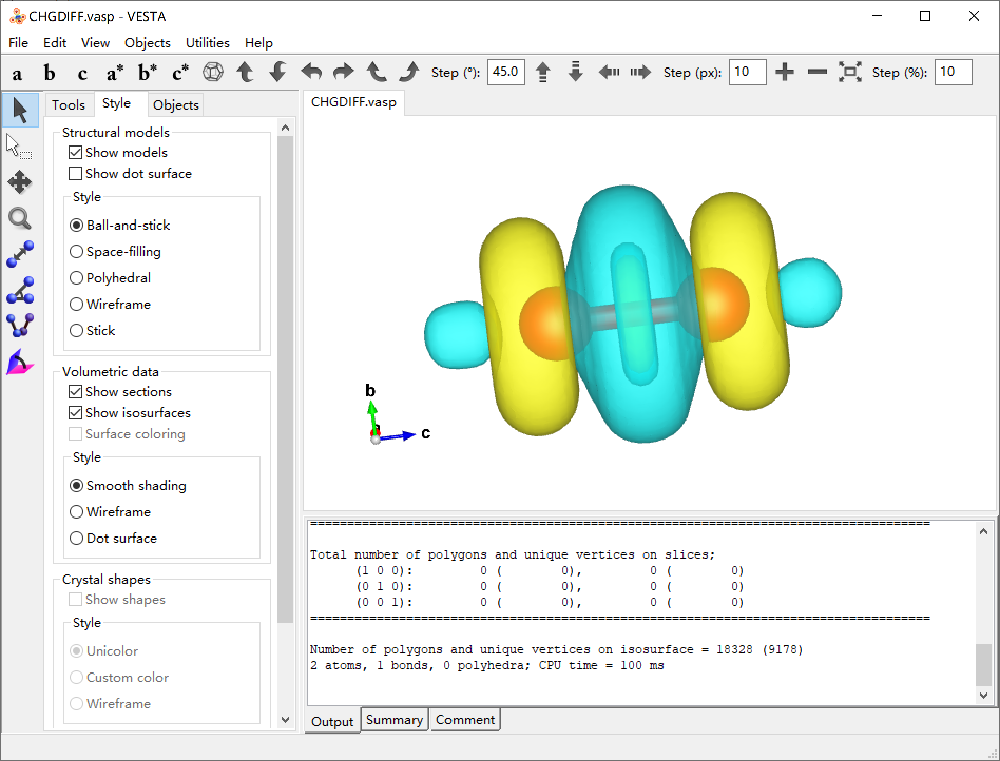
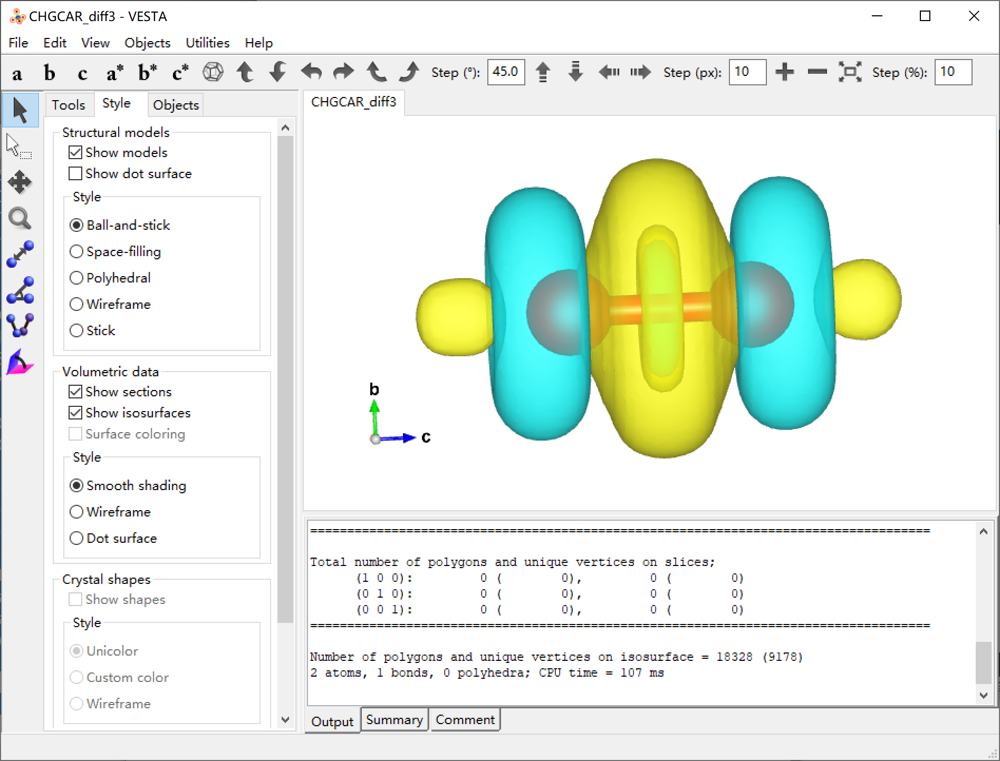

# VASP计算电荷密度差

文献中常用的差分电荷密度图为二次差分电荷密度图(difference charge density)，区别于差分电荷密度图(deformation charge density)。 差分电荷定义为**成键后的电荷密度与对应的点的原子电荷密度之差**。通过差分电荷密度的计算和分析，可以清楚地得到在**成键和成键电子耦合过程中的电荷移动以及成键极化方向等性质**。 “二次”是指同一个体系化学成分或者几何构型改变之后电荷的重新分布。 Deformation charge density 的公式定义为(1)，Difference charge density的公式定义为(2)。Difference charge density是文献中最常用的方法。


 $$
 \Delta \rho = \rho_{AB_{SC}}-\rho_{AB_{atom}}   \qquad (1)\\
 \Delta \rho = \rho_{AB}-\rho_A-\rho_B   \qquad (2)\\
 \Delta \rho = \rho_{ABC}-\rho_{A}-\rho_{B}-\rho_{C}  \qquad (3)
 $$


以计算$O_2$电荷密度差为例，记录如何获得O2的Difference charge density。

## 流程

以A-B型为例

- 对AB进行结构优化
- 分别对AB、A、B分别静电自洽 （不能结构优化）
  - FFT mesh需要一致
  - LCHARG需要打开
- 求差（chgsun.pl CHGCAR_A CHGCAR_B；chgdiff.pl CHGCAR_AB CHGCAR_sum）

电荷密度差分操作本可以在之前 [O2结构优化、自洽、非自洽](..\02.结构优化与静电自洽\02.vasp-opt.md) 自洽之后进行，但是之前的自洽没有规定FFT mesh，而电荷密度差分要求了，所以干脆从头算好了。

## 目录结构

::: details

```bash
[zjb@op O2_chg_diff]$ tree
.
├── O2             # 在此目录对O2分子进行结构优化，然后静电自洽
│   ├── CHG
│   ├── CHGCAR
│   ├── CONTCAR
│   ├── INCAR
│   ├── KPOINTS
│   ├── OSZICAR
│   ├── OUTCAR
│   ├── POSCAR
│   ├── POTCAR
│   ├── stdout
│   └── vasp.pbs
├── A              # 对其中一个O进行静电自洽
│   ├── CHG
│   ├── CHGCAR
│   ├── CONTCAR
│   ├── INCAR
│   ├── KPOINTS
│   ├── OSZICAR
│   ├── OUTCAR
│   ├── out.log
│   ├── POSCAR
│   ├── POTCAR
│   ├── stdout
│   └── vasp.pbs
├── B              # 对另一个O进行静电自洽
│   ├── CHG
│   ├── CHGCAR
│   ├── CONTCAR
│   ├── INCAR
│   ├── KPOINTS
│   ├── OSZICAR
│   ├── OUTCAR
│   ├── POSCAR
│   ├── POTCAR
│   ├── REPORT
│   ├── stdout
│   └── vasp.pbs
├── CHGCAR_diff   # 差分电荷密度
└── CHGCAR_sum    # 两个单独O加在一起的电荷密度

3 directories, 62 files
```
::: 


## 步骤

### Step1：对AB进行结构优化 geo

在`O2`目录中对O2进行结构优化

:::: tabs
::: tab POSCAR

```
[zjb@op O2]$ cat POSCAR：
O2
1
10 0 0
0 10 0
0 0 12
O
2
S
D
0.5 0.5 0.5   F F F
0.5 0.5 0.62  F F T
```
:::
::: tab INCAR

```
[zjb@op O2]$ cat INCAR：
Global Parameters
 ISTART =  1            (Read existing wavefunction; if there)
 ISPIN =  2           (Spin polarised DFT)
 ICHARG =  2         (Non-self-consistent: GGA/LDA band structures)
 LREAL  = .FALSE.          (Projection operators: automatic)
 ENCUT  =  400        (Cut-off energy for plane wave basis set, in eV)
 PREC   =  Normal       (Precision level)
 LWAVE  = .TRUE.        (Write WAVECAR or not)
 LCHARG = .TRUE.        (Write CHGCAR or not)
 ADDGRID= .TRUE.        (Increase grid; helps GGA convergence)
 NGXF    = 150         (FFT grid mesh density for nice charge/potential plots)
 NGYF    = 150         (FFT grid mesh density for nice charge/potential plots)
 NGZF    = 180         (FFT grid mesh density for nice charge/potential plots)

Electronic Relaxation
ISMEAR =  0            (Gaussian smearing; metals:1)
SIGMA  =  0.05         (Smearing value in eV; metals:0.2)
NELM   =  60           (Max electronic SCF steps)
NELMIN =  4            (Min electronic SCF steps)
EDIFF  =  1E-06        (SCF energy convergence; in eV)

Ionic Relaxation
NSW    =  20          (Max electronic SCF steps)
IBRION =  2            (Algorithm: 0-MD; 1-Quasi-New; 2-CG)
ISIF   =  2            (Stress/relaxation: 2-Ions, 3-Shape/Ions/V, 4-Shape/Ions)
EDIFFG = -2E-02        (Ionic convergence; eV/AA)
```
:::
::: tab CONTCAR

```
[zjb@op O2]$ cat CONTCAR
O2                                      
   1.00000000000000     
    10.0000000000000000    0.0000000000000000    0.0000000000000000
     0.0000000000000000   10.0000000000000000    0.0000000000000000
     0.0000000000000000    0.0000000000000000   12.0000000000000000
   O 
     2
Selective dynamics
Direct
  0.5000000000000000  0.5000000000000000  0.5000000000000000   F   F   F
  0.5000000000000000  0.5000000000000000  0.6028640220057100   F   F   T
 
  0.00000000E+00  0.00000000E+00  0.00000000E+00
  0.00000000E+00  0.00000000E+00  0.00000000E+00
```
:::
::::

结构优化完成之后将`CONTCAR`作为新的`POSCAR`进行后续运算。 

```bash
 [zjb@op O2]$ cp COUTCAR POSCAR
```


### Step2：静电自洽

::: tip
三次静电自洽需要注意：

- FFT mesh需要一致
- LCHARG需要打开
::: 

#### 对A-B进行静电自洽 scf

将上一步的`INCAR`修改，使其满足静电自洽的运行：

```
NSW = 0
IBRION = -1
```

提交作业进行静电自洽。

#### 对A、B分别静电自洽

将A-B静电自洽用的INCAR、POSCAR、POTCAR、KPOINTS复制出来，分别放在A和B目录中。

```bash
[zjb@op O2]$ cp INCAR POSCAR POTCAR KPOINTS ../A/
[zjb@op O2]$ cp INCAR POSCAR POTCAR KPOINTS ../B/
```

在A目录的POSCAR中删除B部分对应的点，元素数量改一下，得到A部分的POSCAR，提交作业静电自洽。

在B目录的POSCAR中删除A部分对应的点，元素数量改一下，得到B部分的POSCAR，提交作业静电自洽。

```bash {8,11,25,28}
[zjb@op O2_chg_diff]$ cat A/POSCAR 
O2                                      
   1.00000000000000     
    10.0000000000000000    0.0000000000000000    0.0000000000000000
     0.0000000000000000   10.0000000000000000    0.0000000000000000
     0.0000000000000000    0.0000000000000000   12.0000000000000000
   O 
     1
Selective dynamics
Direct
  0.5000000000000000  0.5000000000000000  0.5000000000000000   F   F   F
 
  0.00000000E+00  0.00000000E+00  0.00000000E+00
  0.00000000E+00  0.00000000E+00  0.00000000E+00


[zjb@op O2_chg_diff]$ cat B/POSCAR 
O2                                      
   1.00000000000000     
    10.0000000000000000    0.0000000000000000    0.0000000000000000
     0.0000000000000000   10.0000000000000000    0.0000000000000000
     0.0000000000000000    0.0000000000000000   12.0000000000000000
   O 
     1
Selective dynamics
Direct
  0.5000000000000000  0.5000000000000000  0.6028640220057100   F   F   T
 
  0.00000000E+00  0.00000000E+00  0.00000000E+00
  0.00000000E+00  0.00000000E+00  0.00000000E+00

```

### Step3：求差

求差也可以使用`VASPKIT`提供的功能。

在主菜单选择`31) Charge & Spin Density`，之后进入`314) Charge-Density Difference `，在下一个界面提示输入`O2/CHGCAR A/CHGCAR B/CHGCAR`。

```bash
======================= File Options ============================
 Input the Names of Charge/Potential Files with Space: 
 (e.g., to get AB-A-B, type: ~/AB/CHGCAR ./A/CHGCAR ../B/CHGCAR)
 
 ------------>>
O2/CHGCAR A/CHGCAR B/CHGCAR
 
  -->> (01) Reading Structural Parameters from O2/CHGCAR File...
  -->> (02) Reading Charge Density From O2/CHGCAR File...
  -->> (03) Reading Structural Parameters from A/CHGCAR File...
  -->> (04) Reading Charge Density From A/CHGCAR File...
  -->> (05) Reading Structural Parameters from B/CHGCAR File...
  -->> (06) Reading Charge Density From B/CHGCAR File...
  -->> (07) Written CHGDIFF.vasp File!
 +---------------------------------------------------------------+
 |                       * ACKNOWLEDGMENTS *                     |
 | Other Contributors: Xue-Fei LIU, Peng-Fei LIU, Dao-Xiong WU,  |
 | Zhao-Fu ZHANG, Tian WANG, Ya-Chao LIU, Qiang LI, iGo and You! |
 +---------------------------------------------------------------+
 |                          * CITATIONS *                        |
 | We Would Appreciate if You Cite in Your Research with VASPKIT.|
 | [1] V. Wang, N. Xu, J.C. LIU, G. Tang, et al, VASPKIT: A Pre- |
 | and Post-Processing Program for VASP Code, arXiv:1908.08269.  |
 +---------------------------------------------------------------+
[zjb@op O2_chg_diff]$ ls
A  B  CHGCAR_diff  CHGCAR_sum  CHGDIFF.vasp  O2

```

输出一个`CHGDIFF.vasp`，即为所求，下载，VESTA打开：




## 其他

### 求差的其他方法

#### chgsum.pl

```bash
#Usage
$ chgsum.pl <CHGCAR_A> <CHGCAR_B>  # output: CHGCAR_sum

# This example
 [zjb@op O2_chg_diff]$ chgsum.pl A/CHGCAR B/CHGCAR
```

作用为：

$$
\rho_{(CHGCAR\_sum)} = \rho_{A} + \rho_B
$$

运行后在`O2_chg_diff/`下生成了一个`CHGCAR_sum`文件。

#### chgdiff.pl

```bash
# Usage
chgdiff.pl <CHGCAR_sum> <CHGCAR_AB>  # output: CHGCAR_diff

# This example
 [zjb@op O2_chg_diff]$ chgdiff.pl O2/CHGCAR CHGCAR_sum
```

注意是后面的减前面的：

$$
\rho_{(CHGCAR\_diff)} = \rho_{CHGCAR\_AB} - \rho_{CHGCAR\_sum}
$$

执行后在`O2_chg_diff/`下生成了一个`CHGCAR_diff`文件，即为电荷密度差，因为

$$
\begin{aligned}
\Delta \rho &= \rho_{AB} - \rho_A - \rho_B \\
&= \rho_{AB} - (\rho_A + \rho_B) \\
&=\rho_{AB} - \rho_{CHGCAR\_sum} 
\end{aligned}
$$


#### 显示

下载`CHGCAR_diff`，使用`VESTA`显示：



### 为什么chgdiff.pl是后减前？

读取源码：

```perl
#!/usr/bin/env perl
#;-*- Perl -*-

@args = @ARGV;
@args == 2 || die "usage: chgdiff.pl <reference CHGCAR> <CHGCAR2>\n";

open (IN1,$args[0]) || die ("Can't open file $!");
open (IN2,$args[1]) || die ("Can't open file $!");
open (OUT,">CHGCAR_diff");

for ($i=0; $i<5; $i++) {
    $line1 = <IN1>;
    $line2 = <IN2>;
    $header1 .= $line1;
}

...

for ($i=0; $i<$psum1/5; $i++) {
    $line1 = <IN1>;
    $line1 =~ s/^\s+//;
    $line2 = <IN2>;
    $line2 =~ s/^\s+//;
    @line1 = split(/\s+/,$line1);
    @line2 = split(/\s+/,$line2);
    for ($j=0; $j<@line1; $j++) {
        $line1[$j] = $line2[$j]-$line1[$j];
    }
#    printf OUT " %18.11E %18.11E %18.11E %18.11E %18.11E\n",$line1[0],$line1[1],$line1[2],$line1[3],$line1[4];
    printf OUT " %18.11E" x @line1 . "\n", @line1;
}

...
```

第5行：用法：`chgdiff.pl <CHGCAR_1> <CHGCAR_2>`.

第7-15行：第一个参数`CHGCAR_1`里的每一行记为`line1`，第二个参数`CHGCAR_2`里的每一行记为`line2`.

第27行，`line2-line1`，即`CHGCAR_2 - CHGCAR_1`，即为后减前。

### chgdiff.pl后少了原子

由源码得，`chgdiff.pl`保留的是file1的原子信息，所以如果file1只有部分原子就会缺。

这个脚本我感觉是bug，建议把上面第27行`line2-line1`改成`line1-line2`一劳永逸。